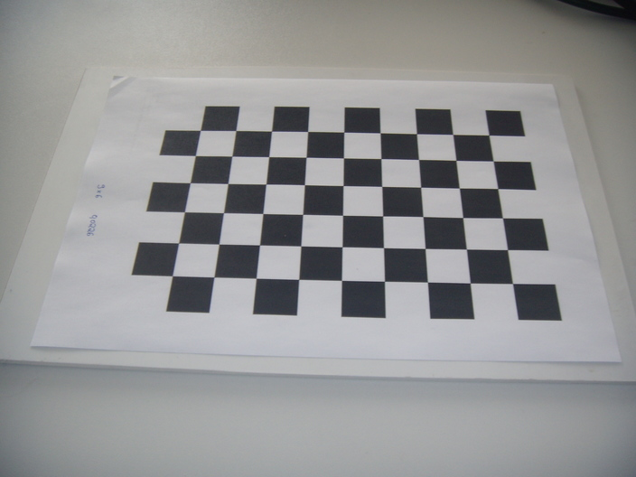

In your repository you will find seven images of a checkerboard pattern captured from different view
points, such as the following image:

For each image the code already provides the coordinates of the four corners marked with circles
both in the world coordinate frame S_o and in the sensor coordinate frame S_s. The world 
coordinate frame will be drawn as (X, Y, Z) = (red, green, blue) in the output images.
Calculate the camera's intrinsic parameters and the camera poses from where the images were
captured following these steps:

1. Build and solve the linear system `Q h = r` in the method `homographyFromPoints` and return the 
homography matrix `H` (see the 
[exercise sheet on the course web page](https://www.hrl.uni-bonn.de/teaching/ss15/exercise-sheet-02) 
for instructions).
2. Follow slides 40-57 to build the linear system `V b = 0` where `V` is a `2n x 6 = 14 x 6` matrix.
First implement the auxiliary method `getV` that computes the vector `v` as a function of 
`i` and `j` (see slide 57), then use this method in `calculateB` to build the matrix `V`. The 
existing code at the end of the method will then solve Equation (8) and return the matrix `B`.
3. Implement the method `calibrationMatrix` to compute the calibration matrix `K` from the
matrix `B := K^−T K^−1` using Cholesky factorization. The Cholesky factorization is called
`llt()` in Eigen, named after its definition `chol(M) = LL^T`.
4. Implement the method `computeCameraPose` to compute the camera transformation matrix
`(r1 r2 r3 t)` that indicates the pose of the camera while taking the image. Use the equation
`H = K (r1 r2 t)` and the fact that `r1`, `r2`, and `r3` form an orthonormal basis.

